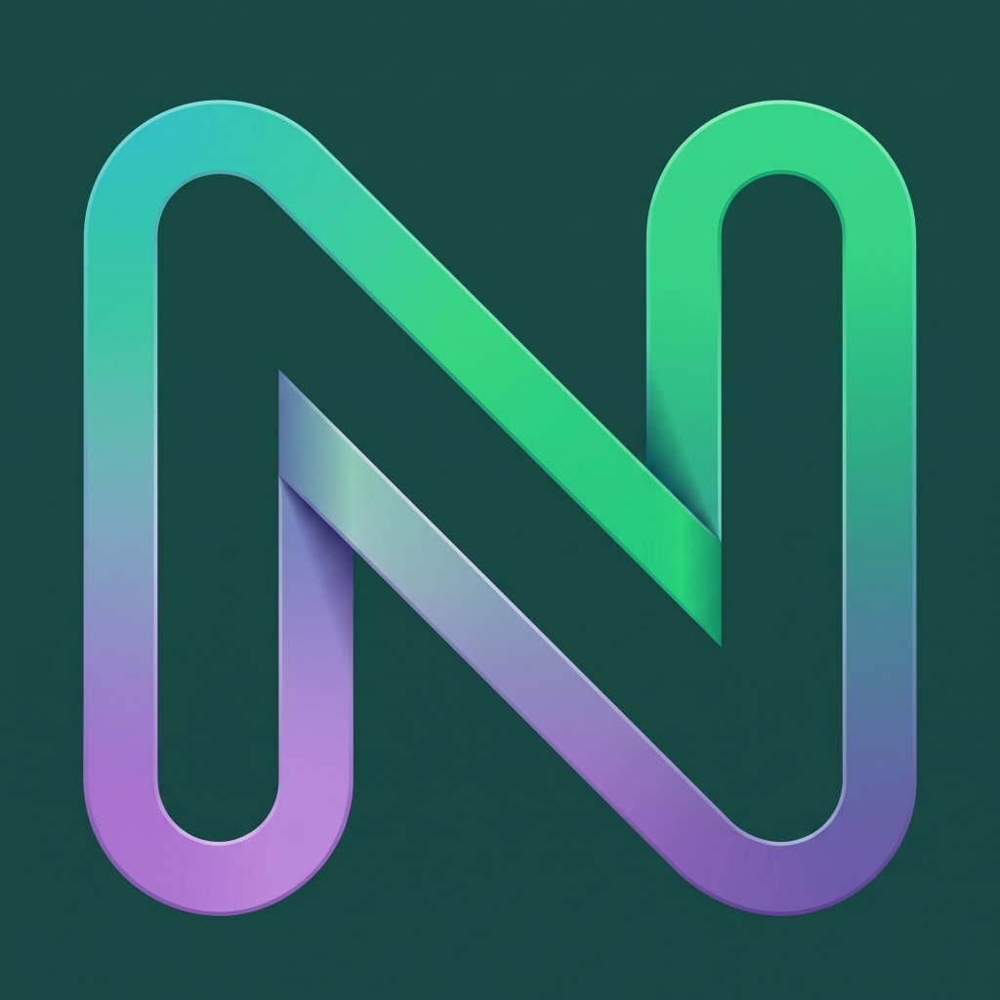

<p align="center">
  
</p>

<h1 align="center">NODO Protocol</h1>
<p align="center">
  <strong>Delivery Descentralizado · Cero Comisiones · Impulsado por IA</strong>
</p>
<p align="center">
  <a href="#arquitectura">Arquitectura</a> · <a href="#tech-stack">Stack</a> · <a href="#cómo-correrlo">Cómo Correrlo</a> · <a href="#flujo-demo">Demo</a>
</p>

---

## ¿Qué es NODO?

NODO es un **protocolo P2P de logística** que elimina a los intermediarios extractivos como Rappi o UberEats. En lugar de cobrar un 30% de comisión a los restaurantes, NODO usa:

- 🤖 **Agentes de IA (Gemini)** para evaluar condiciones en tiempo real (tráfico, clima, distancia) y negociar tarifas de envío justas e imparciales al instante (Swarm Intelligence).
- ⛓️ **Liquidación Atómica on-chain (Stellar Testnet)** usando un sistema de custodia (Escrow). Los fondos del cliente se bloquean criptográficamente y solo se liberan al restaurante y repartidor cuando se confirma la entrega. Todo con "Account Abstraction" para que el usuario no necesite saber de wallets.
- 🔐 **Verificación Anti-Fraude** con un PIN de 6 dígitos que el cliente debe entregar al repartidor para desbloquear el pago en la blockchain.

**Resultado**: Restaurantes ganan 100% del precio de su menú. Repartidores ganan 100% de la tarifa de envío. Comisión NODO: **0%** (solo un pequeño "Network Fee" para mantener la infraestructura).

---

## Arquitectura

```
┌──────────────────────────────────────────────────────┐
│                     FRONTEND (Next.js 16)            │
│  ┌─────────┐  ┌──────────┐  ┌─────────┐  ┌───────┐   │
│  │ Landing │  │ Customer │  │ Vendor  │  │Courier│   │
│  │  Page   │  │   App    │  │Dashboard│  │  App  │   │
│  └─────────┘  └────┬─────┘  └────┬────┘  └───┬───┘   │
└────────────────────┼─────────────┼───────────┼───────┘
                     │ REST API    │ WebSocket │ REST
                     ▼             ▼           ▼
┌──────────────────────────────────────────────────────┐
│               BACKEND (Express + Socket.io)          │
│  ┌──────────┐  ┌───────────┐  ┌──────────────────┐   │
│  │ Auth     │  │ Order     │  │ AI Negotiation   │   │
│  │ JWT+bcrypt│ │ Lifecycle │  │ (Gemini 2.0)     │   │
│  └──────────┘  └─────┬─────┘  └──────────────────┘   │
│                      │                               │
│            ┌─────────▼─────────┐                     │
│            │   Prisma ORM      │                     │
│            │   (SQLite DB)     │                     │
│            └───────────────────┘                     │
└──────────────────────┬───────────────────────────────┘
                       │ Horizon API SDK
                       ▼
┌──────────────────────────────────────────────────────┐
│                BLOCKCHAIN (Stellar Testnet)          │
│  ┌──────────────────────────────────────────────┐    │
│  │  Gasless Smart Accounts                      │    │
│  │  lockEscrow() → manageData operation         │    │
│  │  Atomic settlement via Stellar Network       │    │
│  └──────────────────────────────────────────────┘    │
└──────────────────────────────────────────────────────┘
```

---

## Tech Stack

| Capa | Tecnología |
|------|-----------|
| **Frontend** | Next.js 16, TypeScript, Tailwind CSS, Lucide Icons |
| **Backend** | Express.js, Socket.io, Prisma ORM |
| **Base de Datos** | SQLite (dev) |
| **Inteligencia Artificial**| Google Gemini 2.0 Flash (Agente Logístico) |
| **Blockchain** | Stellar SDK, Horizon Server (Testnet) |
| **Seguridad** | JWT Auth, bcrypt, Gasless Smart Accounts |

---

## Cómo Correrlo

### Prerrequisitos
- Node.js 18+
- npm

### 1. Clonar e instalar

```bash
git clone https://github.com/diegoc1005/p2p-delivery-mvp.git
cd p2p-delivery-mvp
npm install
cd backend && npm install && cd ..
```

### 2. Configurar variables de entorno

```bash
# Crea un archivo .env en la carpeta backend/
# backend/.env
GEMINI_API_KEY=tu-api-key-de-gemini
STELLAR_SECRET_KEY=tu-llave-secreta-stellar-testnet
PORT=3001
```

### 3. Inicializar base de datos

```bash
cd backend
npx prisma db push
npx ts-node prisma/seed.ts
```

### 4. Correr ambos servidores

```bash
# Terminal 1: Backend
cd backend && npm run dev

# Terminal 2: Frontend
npm run dev
```

- Frontend: `http://localhost:3000`
- Backend: `http://localhost:3001`

---

## Flujo Demo para Jueces

### Credenciales de prueba

| Rol | Email | Password |
|-----|-------|----------|
| 🍔 Cliente | demo@nodo.mx | 123456 |
| 🏪 Restaurante | burger@nodo.mx | 123456 |
| 🛵 Courier | courier@nodo.mx | 123456 |

### El "Camino Feliz"

1. **Abre 3 ventanas de incógnito** en tu navegador.
2. **Ventana 1 (Cliente)** → `/auth` → Login como Cliente (`demo@nodo.mx`).
3. **Ventana 2 (Restaurante)** → `/auth` → Login como Restaurante (`burger@nodo.mx`). Encontrarás analíticas avanzadas de ahorro frente a plataformas tradicionales.
4. **Ventana 3 (Repartidor)** → `/auth` → Login como Courier (`courier@nodo.mx`).
5. **Como Cliente**: Elige un restaurante → Agrega items → Carrito → **"Cotizar con IA"** (verás cómo Gemini negocia la tarifa) → **"Confirmar y Pagar"**.
6. **Magia Blockchain**: El backend hace un `lockEscrow` en la Testnet de Stellar. El Hash de transacción aparecerá en el perfil del cliente en su "Smart Account".
7. **Como Restaurante**: Verás la orden aparecer con notificaciones Web nativas → Click "Aceptar y Preparar".
8. **Como Courier**: El viaje aparece en tu tablero → "Aceptar Viaje" → Vas por la orden → Ingresa el PIN criptográfico del cliente → "Verificar y Cobrar".
9. **Liquidación Atómica**: Los fondos se liberan en la Blockchain. Cero humanos, cero intermediarios.

---

## Equipo

Proyecto creado con estándares AAA para **GOYA Hack 2026** 🚀

---

<p align="center">
  <em>NODO Protocol — El ecosistema justo.</em>
</p>
